# Push2D2

A Raspberry PI based "push-to" telescope system.

## TLDR;
- Dob 12" telescope with two rotary encoders mounted on both axis
- Raspberry Pi runs custom software that converts encoder signals to Azimuth and Altitude coordinates
- Run Stellarium on my Macbook Pro, connected to the Raspberry Pi mounted on Dob with USB serial connection
- Stellarium queries for [Equatorial Coordinates](https://en.wikipedia.org/wiki/Equatorial_coordinate_system), Raspberry Pi converts from [Horizon Coodinates](https://en.wikipedia.org/wiki/Horizontal_coordinate_system#:~:text=The%20horizontal%20coordinate%20system%20is,%2Dazimuth%20system%2C%20among%20others.) to Equatorial on demand.
- Stellarium displays what the scope is pointed on screen, as the telescope moves Stellarium updates the scope's position in realtime
- Calibration is simple: point the scope at a well known object, tell Stellarium to `sync` to that object. 

## Overview
What is a "push-to" telescope system? I'd define it as a system that provides 
information to an astronomer that enables them to manually move the 
telescope to the desired target (accurately). 

Some implementations provide explicit instructions: `move up, move left, move right, etc...` 
to navigate to the desired target. This project integrates with an external planetarium 
software that understands the Meade LX200 Serial Command [Protocol](docs/Meade%20Telescope%20Serial%20Command%20Protocol%20Manual.pdf): Stellarium.

Why? There's a saying... `the best telescope is the one you use`. I'm currently under Bortle class 5 night skies. This makes star hopping, while possible, difficult. Integrating my 12" Dobsonian with planetarium software like [Stellarium](http://stellarium.org/) seemed like a fun and challenging way to make Bortle 5 navigation easier.

## Mac Setup
My local setup is relatively straightforward.

- [CLion](https://www.jetbrains.com/clion/download/#section=mac) by JetBrains on the Mac. Remote development is great. Remote debugging works, CMake integration is seamless, and remote header includes is pretty amazing. It is not free, not after 30 days anyway, but it does make remote development on the Raspberry Pi turn-key. There are plenty of things to be frustrated about during development, removing complexities around remote developement and debugging was worth the fee IMO.  
- [git](https://github.com/git-guides/install-git#install-git-on-mac)

## Raspberry PI Setup
The project requires a few dependencies to be installed on the Raspberry PI.

- [gcc](https://gcc.gnu.org/) compiler  
- [cmake](https://cmake.org/) a build system for the build system
- [WiringPi](https://github.com/WiringPi/WiringPi) a popular open source GPIO library for the Raspberry PI
- [libconfuse](https://github.com/libconfuse/libconfuse) an open source config file library
- [p2d2.service](p2d2.service) a systemd service for running P2D2 as a service.

PI Setup commands:
```console
sudo apt-get install gcc
sudo apt-get install cmake
sudo apt-get install wiringpi
wget https://github.com/libconfuse/libconfuse/releases/download/v3.3/confuse-3.3.tar.gz
tar -xf confuse-3.3.tar.gz
cd confuse-3.3/
./configure --prefix=/usr && make -j9
sudo ldconfig
cp p2d2.service /etc/systemd/system
sudo systemctl daemon-reload
sudo systemctl enable p2d2.service
git clone https://github.com/deweyjose/push2d2.git
cd push2d2
cmake .
make
cp src/p2d2 .
```

## The Build

### Raspberry Pi

This project is the result of having a Raspberry Pi lying around with nothing to do...

I'm using an old Raspberry Pi 1 Model B (26 pin). 
It has 17 GPIO pins, 2 of which are for UART serial com port. I only needed 10 GPIO ports so it had plenty to spare.

- 700 MHz single core
- 512 MB RAM
- 26 GPIO pins

### Encoders

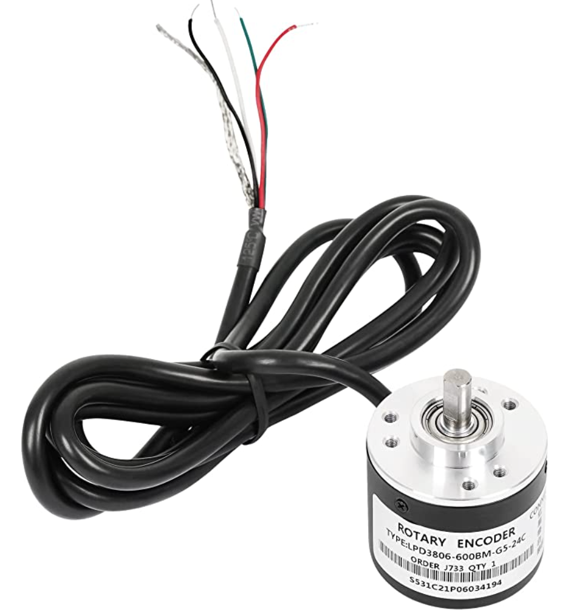

A Dobsonian telescope pivots around two axis. This system uses two incremental rotary encoders mounted at both pivot points of the telescope.

The encoders I purchased are `600 P/R` - 600 pulses per revolution with A and B phases. We can actually measure 4 changes per period if we code it correctly - so 2400 pulses. More on that later in the doc.
It's out of scope, way out of scope, to describe in detail how Quadature encoder generates A and B signals. Please see the link in the appendix for a real explanation on Wikipedia :).

In the images below we see a clockwise rotation as phase B leads phase A. 
We'd see the opposite, A lead phase B if the shaft was rotating counterclockwise.
As the encoder rotates the RPI detects changes in the GPIO pin status and either decrements or
increments a count, which can then be transformed into degrees - we know the total count per revolution. 

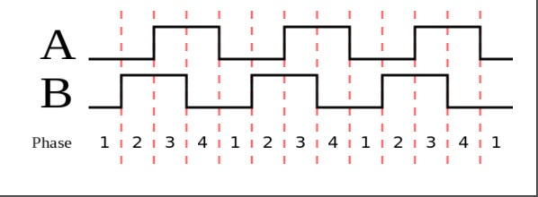

The encoder has 4 wires - ground, 5V, B phase (white), A phase (green). Phase A and B are connected to 
GPIO pins on the RPI and a 10K pull-up resistor connects A and B to 5V.

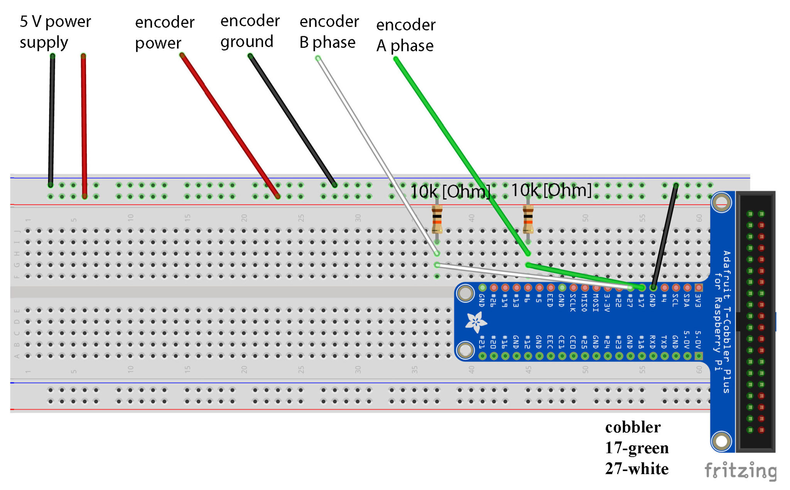

### Angular Diameters...
Some back of the envelope math:

- 360° of rotation == 21600' (arcmins) == 1296000" (arcsecs)
- Each encoder pulse represents 540" (0.15&deg; of night sky).
- 86400 seconds per day.
- Earth rotates about 15" per second.

Some additional perspective on angular diameters: The Sun is 32'32", Moon 29'24" and Betelgeuse is 0.055". 

The encoder by itself is not precise enough to be useful here. 
I can see anything in the sky 0.15&deg; wide, even in Bortle 5.

### Custom Parts - 3D Printing...

We can overcome the precision issue with the encoder with some help from gears. 
We can map multiple rotations of the encoder shaft into 360&deg; of the night sky.

Gear ratio: `Gear ratio is calculated by dividing the angular or rotational speed of the output shaft by the angular speed of the input shaft. It can also be calculated by dividing the total driving gear's teeth by the total driven gear's teeth.`

By mounting a small gear to the shaft of the encoder and driving that shaft
with a gear that has more teeth, we can improve the precision of the system: 🍰

Ender Pro V2 to the rescue. $280(ish) to map the imagination into the physical world :). This came in useful later on in the project for printing custom mounts for the Raspberry PI and custom PCB.

I ended up printing a set of gears with a 20:1 gear ration which improved the precision of the system by 20x - pulses now represent 27" - no bad. With a little
more time on TinkerCad I think we could get an even better ratio. I've listed the parts below - they aren't elegant or pretty. This was my first go at anything CAD related. The bare minimum was my goal here.

#### [Azimuth Gear](https://www.tinkercad.com/things/7jbLVABZ8tl-azimuth-gear)
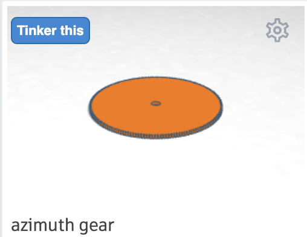

#### [Azimuth Encoder Mount](https://www.tinkercad.com/things/9roYmYTho4I-azimuth-encoder-mount)
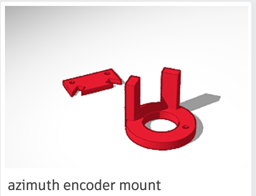

#### [Altitude Gear](https://www.tinkercad.com/things/cpG6YoppGUN-altitude-gear)
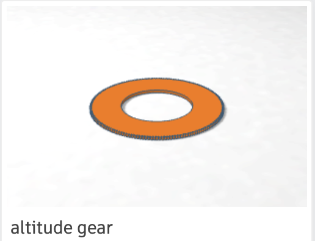

#### [Altitude Encoder Mount](https://www.tinkercad.com/things/5XebiSy127j-altitude-encoder-mount)
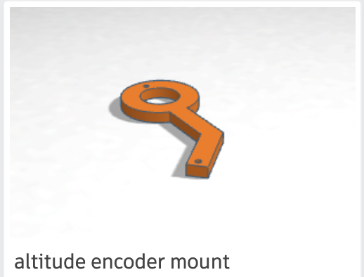

#### [Encoder Shaft Gear](https://www.tinkercad.com/things/fiU2G8Lcno1-encoder-shaft-gear)
This print was interesting and impressive to me. There is a very subtle flat section on the internal structure of the gear.
This allows the gear to be seated on the companion flat section of the encoder shaft to prevent slippage.

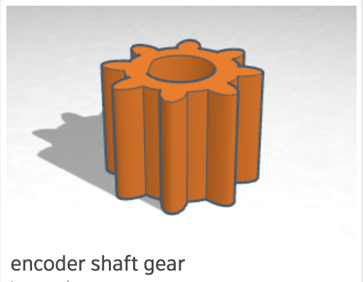

#### [Raspberry Pi Mount](https://www.tinkercad.com/things/40zlwnvdyJU-pimount)
Extremely simple - mount the Pi to this block of plastic, and the block of plastic 
to the side of the Dobsonian mount.

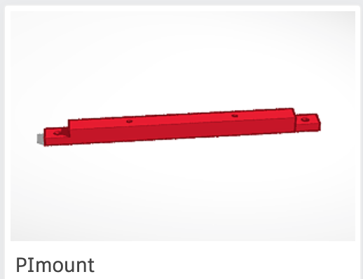

#### [PCB Board Mount](https://www.tinkercad.com/things/dts0tEaL1Ig-pcb-mount)
In the same spirit as the Pi Mount... just get it securely fastened to the Dobsonian mount.

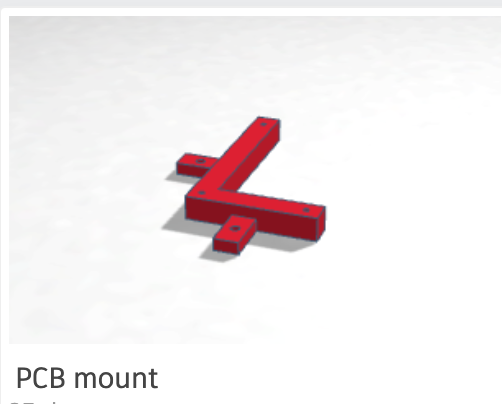

### Code


### Soldering

I did start poc the system with bread boards and tape. 
It became really annoying in the 95&deg; heat wave this summer when 
parts of the system melted off...

Luckily I had a soldering iron kicking around. I ended up solding a breakout
board connected to the Raspberry PI to a solderable PCB board. Once I got the hang of it (3 burns later...)
I found soldering to be pretty satisfying. I'm looking forward to the next project that requires it.

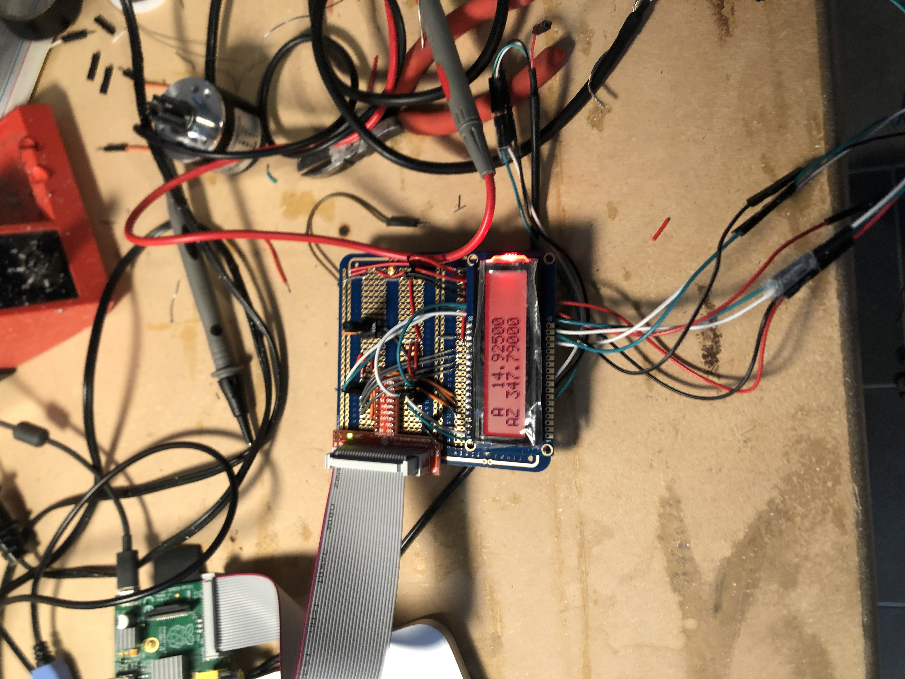

### Installed
Here are a few pictures with all the hardware installed. Not pretty, but does the trick.

<table style="border: none">
<tr>
<td>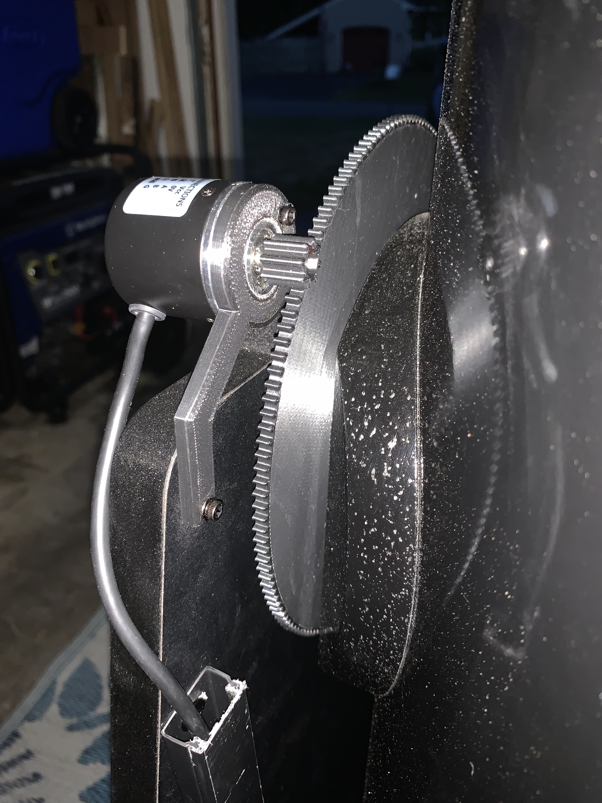</td>
<td>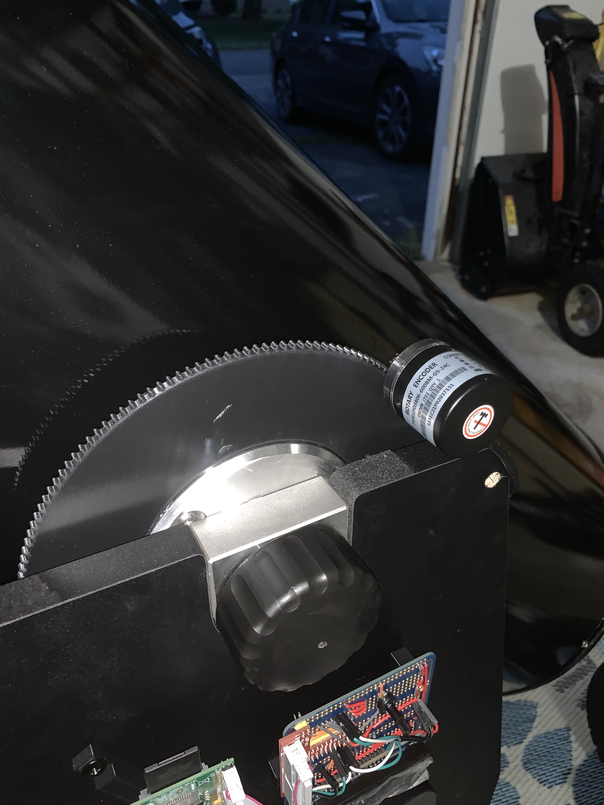</td>
</tr>
<tr>
<td></td>
<td>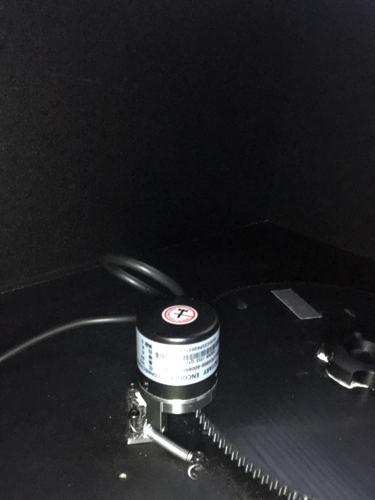</td>
</tr>
<tr>
<td>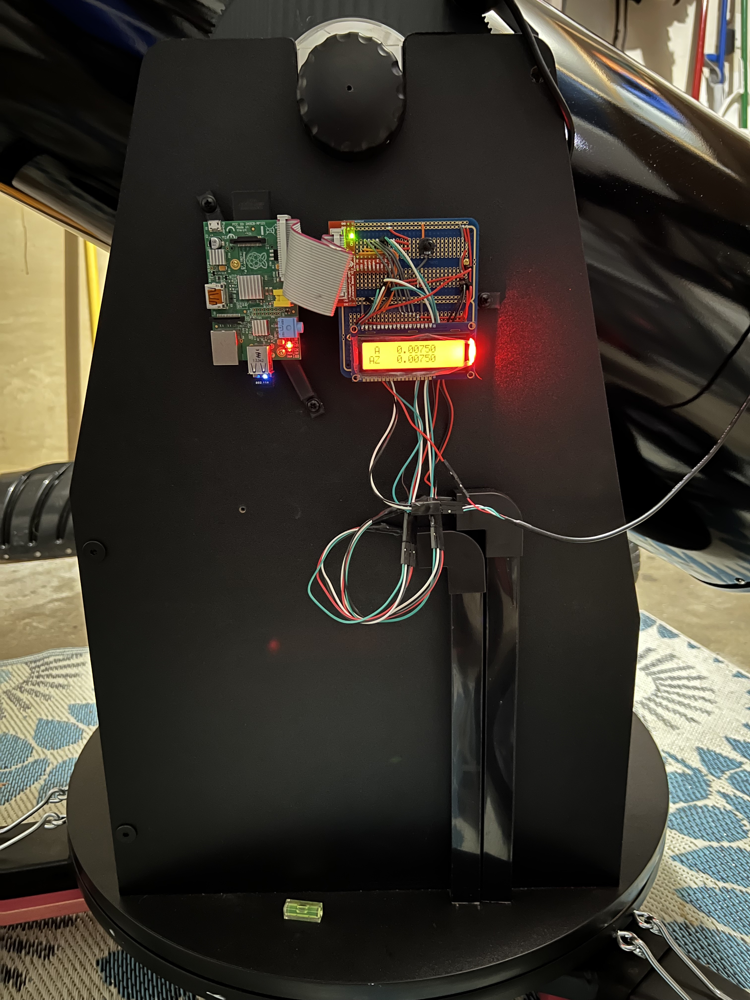</td>
<td>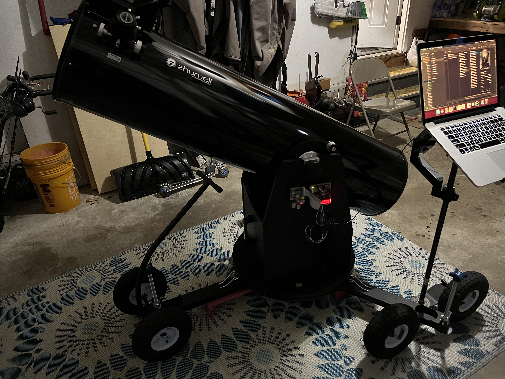</td>
</tr>
</table>

### Rabbit Holes
A few time sinks that almost made me give up.

#### Stick a 3D print
This was pretty painful, actually. I may have scratched the print bed, unsure. 
I ended up applying a coat of glue stick residue on the bed. My success rate when from single digits to 95%.
The base layer of plastic needs to stick to the bed, otherwise you get...

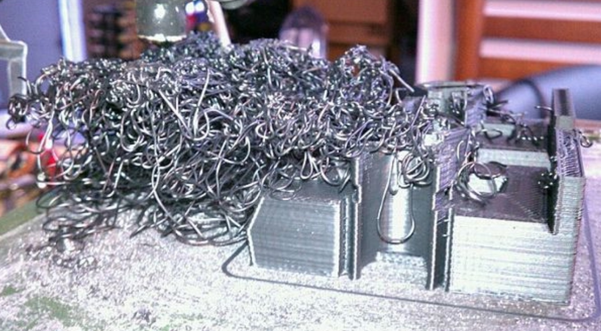

#### Bad Hardware...

Stellarium running on my computer communicates with the Raspberry Pi over a serial connection.

The Rasberry Pi supports Serial communication over the UART pins - TXD, RXD.

Plug one end into of the cable into a USB port, connect the black lead to Pi Ground, White lead to Pi TXD, Green lead to Pi RXD.

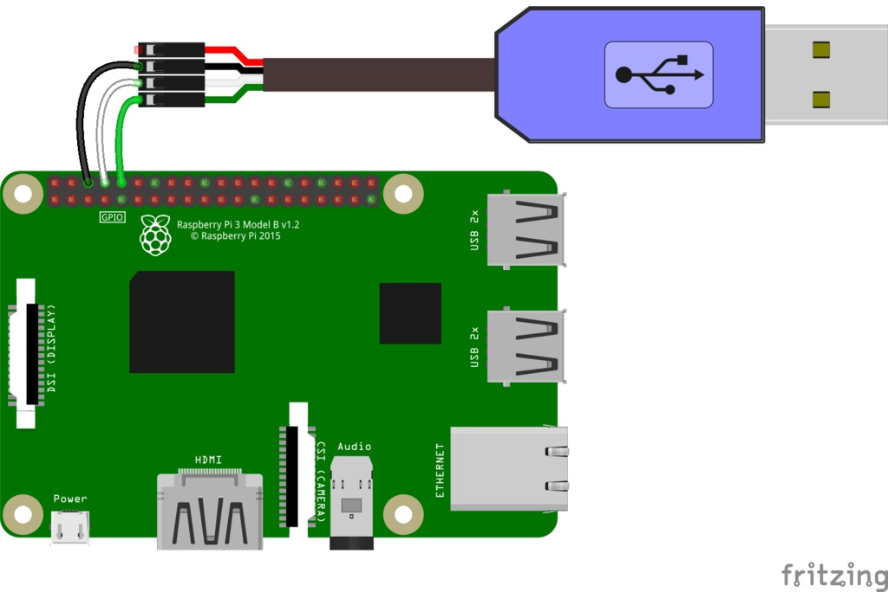

Easy peasy... Except... when the chip is wired like this!

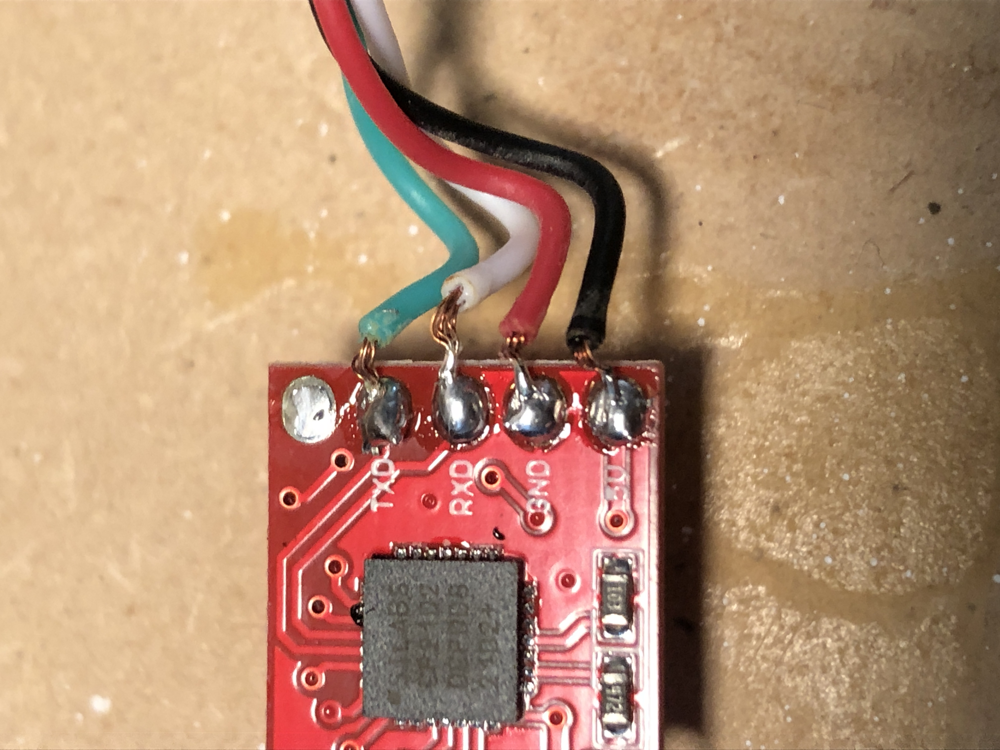

Ultimately I tracked this down with a volt meter. I noticed it was reading -5V so I cracked it open. I was refunded and received a new one no problem.

I did win the battle, but it was 3 days long.

#### C based testing frameworks

Couldn't get catch2, gtest, ctest working... threw it all out and wrote my own
small set of macros for to help me write a custom test executable. Done.

#### The required math

I wasted a lot of time trying to learn all the necessary equations conversions etc via [google searches](https://www.google.com/search?q=convert+horizon+coordinate+to+equatorial&oq=convert+horizon+coordinate+to+equatorial&aqs=chrome..69i57.20723j0j7&sourceid=chrome&ie=UTF-8_). 
There is way too much information out there.

I finally purchased a book, [Practical Astronomy With Your Calculator](https://www.amazon.com/gp/product/1108436072/ref=ppx_yo_dt_b_asin_title_o05_s00?ie=UTF8&psc=1), that really helped. I prototyped the equations in a google sheet first. Once I was able to compute RA and Dec properly there I ported it to [calc.c](src/calc.c).  

# Appendix
- [Practical Astronomy With Your Calculator](https://www.amazon.com/gp/product/1108436072/ref=ppx_yo_dt_b_asin_title_o05_s00?ie=UTF8&psc=1)
- [Dobsonian Telescope](https://en.wikipedia.org/wiki/Dobsonian_telescope)
- [Incremental Encoder](https://en.wikipedia.org/wiki/Incremental_encoder)
- [Bortle Scale](https://en.wikipedia.org/wiki/Bortle_scale)
- [LX200 Protocol](docs/Meade%20Telescope%20Serial%20Command%20Protocol%20Manual.pdf)
- Coordinates
  - [Equatorial Coordinates](https://en.wikipedia.org/wiki/Equatorial_coordinate_system)
  - [Horizon Coodinates](https://en.wikipedia.org/wiki/Horizontal_coordinate_system#:~:text=The%20horizontal%20coordinate%20system%20is,%2Dazimuth%20system%2C%20among%20others.)
- [Rotary Encoder](https://www.amazon.com/gp/product/B085ZLCYS1/ref=ppx_yo_dt_b_asin_title_o05_s00?ie=UTF8&psc=)
- [Great Blog on Rotary Encoders](https://aleksandarhaber.com/incremental-rotary-encoders-with-raspberry-pi-lpd3806-600bm/)
- [Setup USB/Serial Communication with Pi](https://learn.adafruit.com/adafruits-raspberry-pi-lesson-5-using-a-console-cable/overview)
- 3D Printing
  - [Tinker Cad](https://www.tinkercad.com/dashboard)
  - [Ultimaker Cura Slicer](https://ultimaker.com/software/ultimaker-cura)
  - [Ender 3 V2 Printer](https://www.creality3dofficial.com/products/ender-3-v2-3d-printer?gclid=Cj0KCQjwl92XBhC7ARIsAHLl9amTuA4canqASOk2bvKicF2_9SPL7xTxEZlTg8PaVQRL4w-fcuPu8uYaAsC7EALw_wcB)
  - [P2D2 Collection](https://www.tinkercad.com/dashboard?type=tinkercad&collection=projects&id=bIcmGx00Mjo)
- Prior Art
  - [Rotary Encoders With Raspberry Pi](https://aleksandarhaber.com/incremental-rotary-encoders-with-raspberry-pi-lpd3806-600bm/)
  - [Control Your Telescope using Stellarium](https://www.instructables.com/Control-Your-Telescope-Using-Stellarium-Arduino/)
- Hardware
  - [PCB Prototype Board](https://www.amazon.com/gp/product/B07ZV9JQY2/ref=ppx_yo_dt_b_search_asin_title?ie=UTF8&psc=1)
  - [Spacers, Standoffs](https://www.amazon.com/gp/product/B08HS7MFYZ/ref=ppx_yo_dt_b_search_asin_title?ie=UTF8&psc=1)
  - [Cable Hider](https://www.amazon.com/dp/B08MTCFQVN?psc=1&ref=ppx_yo2ov_dt_b_product_details)
  - [Assorted Screws](https://www.amazon.com/dp/B09CP8Z9TY?psc=1&ref=ppx_yo2ov_dt_b_product_details)
  - [Jumper Wires](https://www.amazon.com/dp/B08YRGVYPV?psc=1&ref=ppx_yo2ov_dt_b_product_details)
  - [USB-to-TTL Cable](https://www.amazon.com/gp/product/B00DJUHGHI/ref=ppx_yo_dt_b_asin_title_o08_s00?ie=UTF8&psc=1)
  - [Springs](https://www.amazon.com/gp/product/B07Q2X7KZW/ref=ppx_yo_dt_b_asin_title_o03_s00?ie=UTF8&psc=1)
